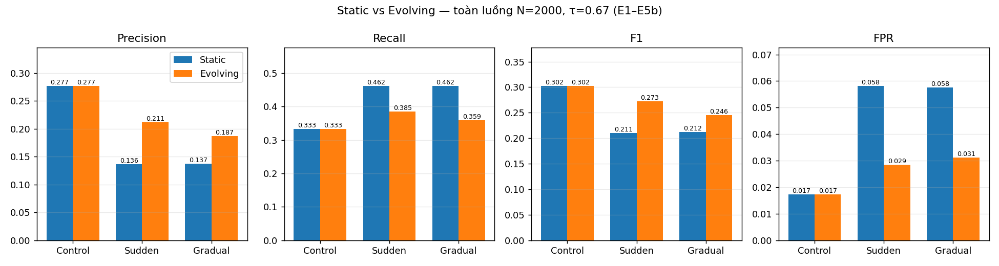
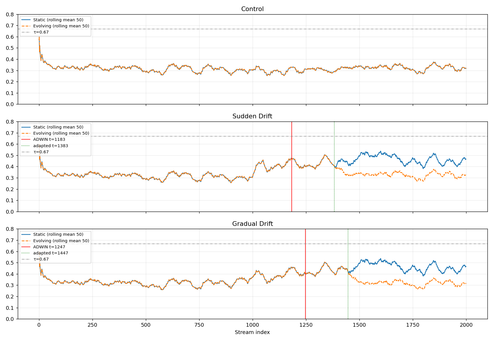
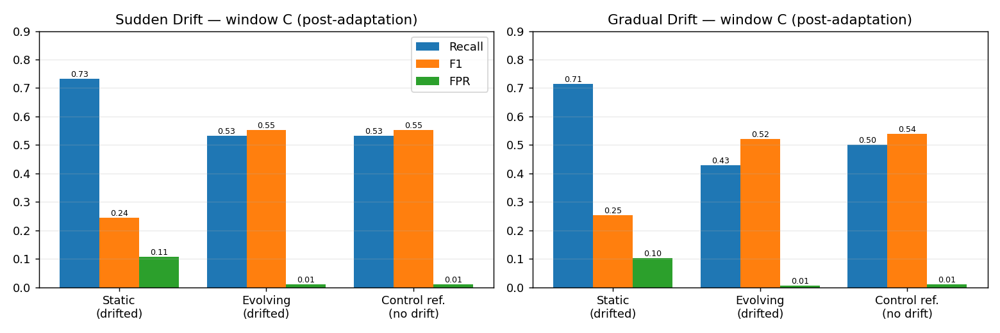
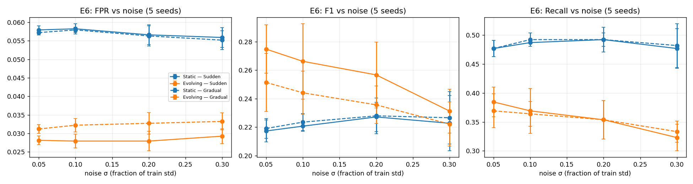
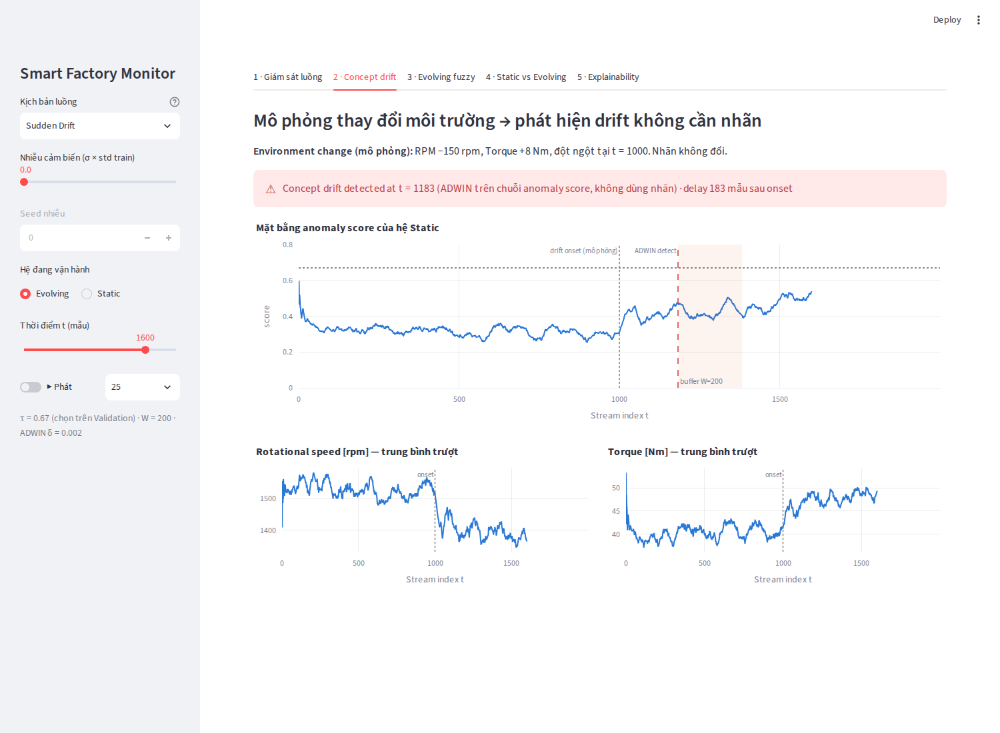
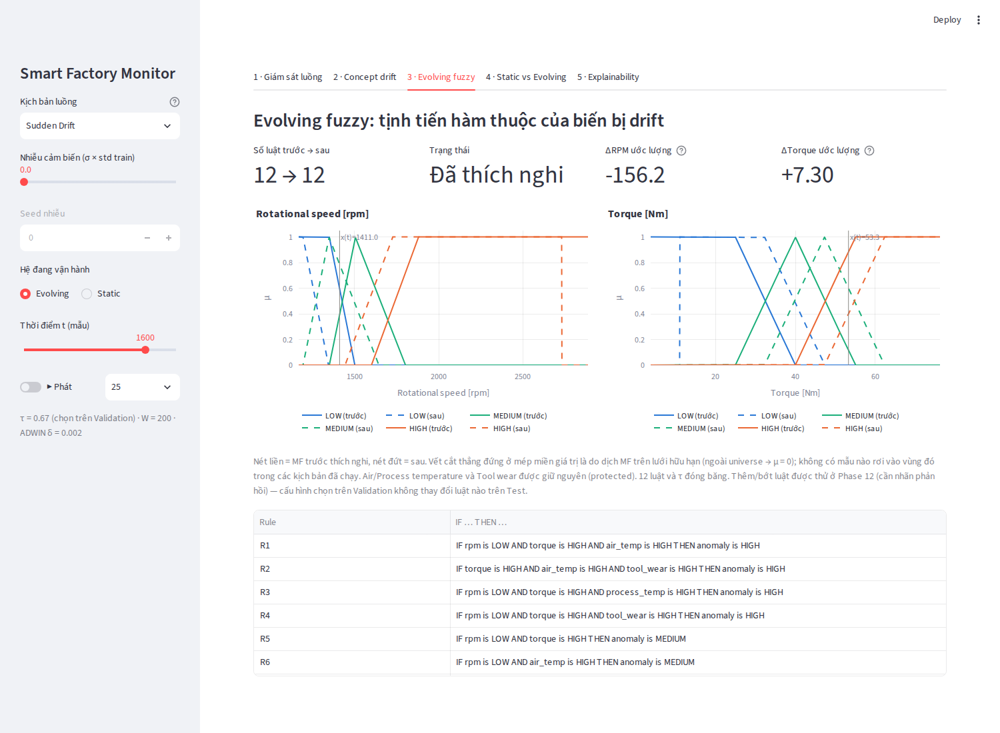
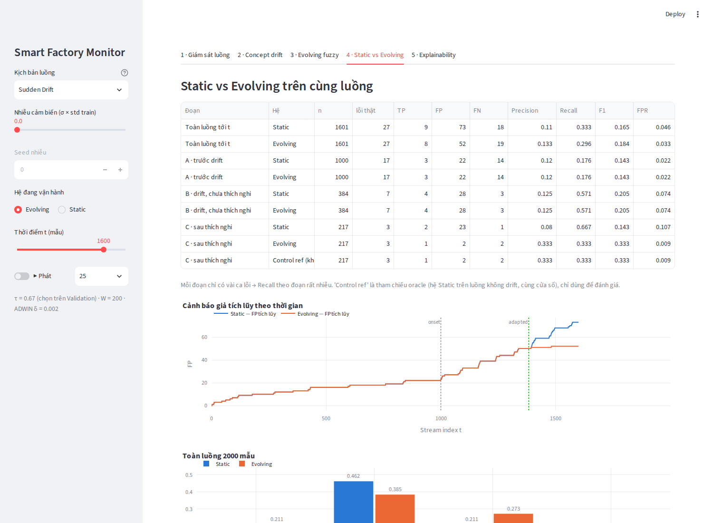
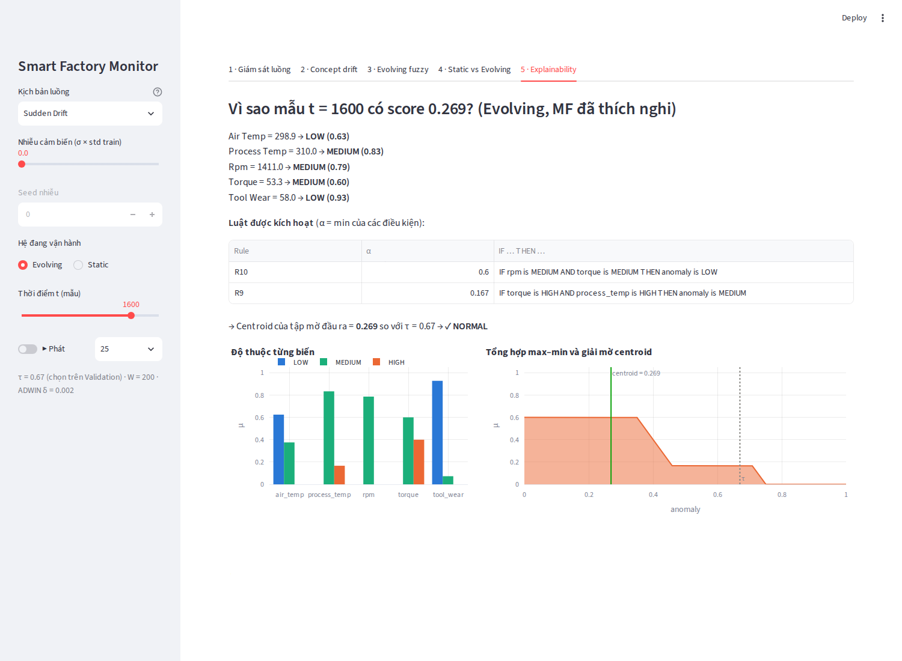

# Báo cáo tổng kết đề tài

# Hệ thống mờ tự tiến hóa phát hiện bất thường dưới Concept Drift

**An Evolving Fuzzy Reasoning System for Sensor Stream Anomaly Detection under Concept Drift**

Môn: Hệ thống thông minh · Chương trình Thạc sĩ CNTT · Học viên: Vũ Quang Vinh

Repository: `Chipzgk/An-Evolving-Fuzzy-Reasoning-System-for-Sensor-Stream-Anomaly-Detection-under-Concept-Drift` · Dữ liệu: AI4I 2020 Predictive Maintenance Dataset (UCI)

---

## Tóm tắt

Đề tài xây dựng một hệ thống thông minh phát hiện bất thường trên luồng dữ liệu cảm biến máy công cụ, dựa trên suy diễn mờ Mamdani, và đánh giá khả năng thích nghi của hệ thống khi phân phối dữ liệu cảm biến thay đổi theo thời gian. Hệ suy diễn mờ gồm 5 biến đầu vào, 15 hàm thuộc và 12 luật chuyên gia. Mỗi mẫu được chấm một điểm bất thường $A(t)\in[0,1]$ rồi so với ngưỡng $\tau = 0.67$, ngưỡng này được chọn trên tập Validation và giữ cố định. Bộ phát hiện ADWIN theo dõi chuỗi $A(t)$ và phát cảnh báo trôi dạt mà **không dùng nhãn**. Sau cảnh báo, hệ thống thu một buffer 200 mẫu không nhãn rồi **tịnh tiến hàm thuộc** của các biến bị trôi dạt; luật và ngưỡng giữ nguyên.

AI4I 2020 không chứa concept drift tự nhiên, nên đề tài thiết kế ba luồng thực nghiệm có kiểm soát từ 2.000 mẫu cuối (Control, Sudden Drift, Gradual Drift; drift được tiêm vào RPM −150 rpm và Torque +8 Nm) và đánh giá theo giao thức prequential *test-then-adapt*.

Kết quả chính trên toàn luồng 2.000 mẫu (39 ca lỗi):

- **Không có drift (E1 và E2):** Static và Evolving **trùng khớp tuyệt đối** (F1 = 0.302). Lý do là ADWIN không báo động giả, nên cơ chế thích nghi không bao giờ kích hoạt.
- **Có drift:** Evolving **giảm khoảng một nửa số cảnh báo giả** (FP 114 → 56 với Sudden, 113 → 61 với Gradual), F1 tăng từ 0.211 lên 0.273 và từ 0.212 lên 0.246. Đổi lại, Recall giảm từ 0.462 xuống 0.385 và 0.359.
- **Phát hiện quan trọng nhất:** ở cửa sổ sau khi thích nghi, hệ Evolving trên luồng Sudden cho **đúng** TP/FP/FN của hệ gốc chạy trên dữ liệu không drift (8/6/7). Nói cách khác, cơ chế **khôi phục hành vi của hệ trước drift**. "Recall cao hơn" của Static dưới drift thực chất đến từ việc drift đẩy mọi điểm số lên, kèm FPR khoảng 10%.

Các thí nghiệm mở rộng cho thấy chiều hướng này giữ được dưới nhiễu và dữ liệu thiếu ở mức vừa phải, nhưng cũng chỉ ra những giới hạn rõ ràng. Thứ nhất, cơ chế **dựa vào việc biết trước kênh cảm biến bị trôi dạt**; quy tắc tự chọn biến đơn giản thất bại do xu hướng nhiệt độ tự nhiên của AI4I. Thứ hai, một lần thích nghi do báo động nhầm có thể làm giảm Recall. Thứ ba, thêm/bớt luật online không cải thiện được kết quả vì dữ liệu lỗi quá ít. Toàn bộ kết quả tái lập được bằng một lệnh.

---

## 1. Giới thiệu

### 1.1. Bài toán

Trong giám sát máy công nghiệp, mô hình phát hiện bất thường được thiết kế trên dữ liệu quá khứ. Khi điều kiện vận hành thay đổi (đổi phôi, đổi chế độ cắt, lão hóa, thay cảm biến), phân phối tín hiệu dịch chuyển và mô hình tĩnh bắt đầu báo động sai hàng loạt. Hệ suy diễn mờ phù hợp với bối cảnh này vì tri thức được biểu diễn bằng luật ngôn ngữ đọc được ("RPM thấp và Torque cao thì nguy cơ cao"). Tuy nhiên, các khái niệm "thấp" và "cao" (tức hàm thuộc) được gắn với phân phối lúc thiết kế, nên cũng lỗi thời khi phân phối đổi.

### 1.2. Mục tiêu

1. Xây dựng hệ suy diễn mờ tĩnh (Static FIS) phát hiện bất thường trên dữ liệu cảm biến.
2. Mô phỏng luồng dữ liệu và các kịch bản trôi dạt có kiểm soát.
3. Phát hiện trôi dạt trực tuyến mà không cần nhãn.
4. Cho hệ mờ thích nghi (evolving) bằng cách cập nhật tri thức mờ khi có trôi dạt.
5. So sánh Static và Evolving trên cùng luồng, bằng các metric phát hiện, thích nghi và độ phức tạp.

### 1.3. Phạm vi và tuyên bố đóng góp

Hướng "evolving fuzzy systems cho dữ liệu luồng có drift" **đã có từ trước**, ví dụ eTS [4] và FLEXFIS [5]. Đề tài không tuyên bố đây là hướng mới. Đóng góp của đề tài nằm ở việc **thiết kế và đánh giá cẩn thận một hệ cụ thể**, gồm:

- một giao thức thực nghiệm chống rò rỉ: split tuần tự, ngưỡng đóng băng, prequential, thích nghi không dùng mốc tiêm drift;
- đầy đủ ma trận đối chứng Static/Evolving × Control/Sudden/Gradual;
- phân tích theo cửa sổ thời gian có tham chiếu "không drift";
- báo cáo trung thực cả các kết quả trung tính và âm tính (chọn biến tự động, thêm/bớt luật).

---

## 2. Dữ liệu và giao thức thực nghiệm

### 2.1. AI4I 2020

AI4I 2020 [1, 2] là bộ dữ liệu predictive maintenance **tổng hợp**, gồm 10.000 mẫu và 14 cột. Không có giá trị thiếu, không có dòng trùng lặp.

| Nhóm | Cột | Vai trò trong đề tài |
| --- | --- | --- |
| Cảm biến | Air temperature [K], Process temperature [K], Rotational speed [rpm], Torque [Nm], Tool wear [min] | **5 đầu vào** |
| Nhãn | Machine failure (339 ca lỗi = 3,39%) | Chỉ dùng để đánh giá |
| Chế độ lỗi | TWF, HDF, PWF, OSF, RNF | **Loại bỏ**, vì dùng làm input sẽ gây rò rỉ nhãn |
| Định danh / loại | UDI, Product ID, Type | Không dùng |

### 2.2. Split tuần tự và phân phối tự nhiên

Dữ liệu được chia theo thứ tự UDI: **Train 6.000 / Validation 2.000 / Test 2.000**. Train dùng để thiết kế hàm thuộc, Validation để chọn ngưỡng, Test làm luồng đánh giá chưa từng được nhìn thấy.

Phân tích ở Phase 3 cho thấy các đoạn này **không đồng nhất một cách tự nhiên**:

- Toàn bộ 115 lỗi HDF nằm trong Train.
- Tỷ lệ lỗi giảm dần: 4,25% ở Train, 2,25% ở Validation, 1,95% ở Test.
- Nhiệt độ không khí của Test thấp hơn Train rõ rệt (298,4 K so với 300,3 K; KS-test $p < 10^{-5}$).

Vì vậy, luồng Test gốc được gọi là **Control (No Injected Drift)**, không gọi là "No Drift".

### 2.3. Ba kịch bản luồng có kiểm soát

Các kịch bản được tạo từ luồng Test (UDI 8001–10000, 2.000 mẫu, 39 ca lỗi). Nhãn và thứ tự mẫu giữ nguyên 100%.

| Kịch bản | Can thiệp |
| --- | --- |
| Control | Không can thiệp |
| Sudden Drift | Từ t = 1000: RPM −150 rpm (≈ 0,91σ), Torque +8 Nm (≈ 0,83σ), clip theo miền vật lý |
| Gradual Drift | Cùng độ dịch, tăng tuyến tính trong t = 800 → 1199, đạt cực đại từ t = 1200 |

> **Giới hạn diễn giải bắt buộc.** Đây là **dịch chuyển phân phối cảm biến có kiểm soát** (covariate shift, $P(X)$ đổi). Nhãn không đổi, nên đề tài **không chứng minh** rằng $P(Y\mid X)$ thay đổi. Cụm từ "concept drift" trong đề tài được dùng theo nghĩa kỹ thuật vận hành.

### 2.4. Giao thức đánh giá prequential

Tại mỗi thời điểm $t$: (1) chấm điểm $x_t$ bằng tri thức hiện có → (2) dự đoán $\hat{y}_t = [A(t) \ge 0.67]$ → (3) cập nhật ADWIN bằng $A(t)$ → (4) nếu đang thu buffer thì đưa $x_t$ vào buffer. Không mẫu nào được dùng để thích nghi trước khi nó đã được chấm điểm. Không có tham số nào (luật, MF, ngưỡng) được chỉnh dựa trên nhãn của Test.

---

## 3. Phương pháp

### 3.1. Hệ suy diễn mờ tĩnh (Mamdani)

- **Hàm thuộc:** mỗi biến có 3 term LOW / MEDIUM / HIGH (LOW và HIGH dạng hình thang, MEDIUM dạng tam giác). Các mốc được đặt theo phân phối của tập Train.
- **Đầu ra:** Anomaly $\in [0,1]$ với 3 term tam giác/hình thang, đỉnh tại 0,25 / 0,50 / 0,75.
- **12 luật chuyên gia:** 4 luật → HIGH, 5 luật → MEDIUM, 3 luật → LOW. Ví dụ:
  - R1: IF RPM is LOW AND Torque is HIGH AND Air temp is HIGH THEN anomaly is HIGH
  - R4: IF RPM is LOW AND Torque is HIGH AND Tool wear is HIGH THEN anomaly is HIGH
  - R10: IF RPM is MEDIUM AND Torque is MEDIUM THEN anomaly is LOW
- **Suy diễn:** AND = min, kéo theo = min, tổng hợp = max, giải mờ centroid trên 1.000 điểm [3].
- **Ngưỡng:** quét τ ∈ [0,50; 0,70] với bước 0,01 trên Validation, lấy giá trị có F1 cao nhất: **τ = 0,67**, sau đó đóng băng.

### 3.2. Phát hiện trôi dạt không giám sát

ADWIN [6] (River [7], δ = 0,002) chạy trên **chuỗi điểm bất thường $A(t)$**, không chạy trên từng cảm biến riêng lẻ. Hệ mờ đóng vai trò nén 5 kênh cảm biến thành một tín hiệu vô hướng có ý nghĩa. ADWIN không bao giờ thấy nhãn.

### 3.3. Cơ chế Evolving: tịnh tiến hàm thuộc dựa trên buffer

Khi ADWIN cảnh báo ở thời điểm $t_d$:

1. Thu $W = 200$ mẫu không nhãn, từ $t_d + 1$ đến $t_d + W$.
2. Với mỗi biến thích nghi $v$: $\Delta_v = \overline{x}_{\text{buffer},v} - C_{\text{MEDIUM},v}$, trong đó $C$ là trọng tâm của MF MEDIUM hiện tại.
3. Tịnh tiến cả 3 MF của $v$: $\mu_{\text{new}}(u) = \mu_{\text{old}}(u - \Delta_v)$.
4. Giữ nguyên MF của Air/Process temperature và Tool wear, giữ nguyên 12 luật và τ.

Các biến thích nghi là **RPM và Torque**, được **chọn trước** ở Phase 6 vì đó là hai kênh bị tiêm drift. Đây là một giả định oracle, được kiểm tra lại ở mục 4.7.

### 3.4. Các cơ chế mở rộng (bonus)

- **Thêm/bớt luật** (Phase 12): dùng nhãn phản hồi trễ, có quality gate trên lịch sử, siêu tham số chọn trên Validation.
- **Multistream + knowledge transfer** (Phase 13): nhiều máy chia sẻ vector $\Delta$ không nhãn với nhau.
- **Dashboard + explainability** (Phase 14): Streamlit, 5 màn hình.

---

## 4. Kết quả

Tất cả số liệu dưới đây được tái lập từ repository (xem mục 8). Mọi thí nghiệm đều dùng τ = 0,67 và W = 200.

### 4.1. Static baseline (Phase 3)

| Tập | TP | FP | FN | Precision | Recall | F1 |
| --- | ---: | ---: | ---: | ---: | ---: | ---: |
| Validation (chọn τ) | 15 | 74 | 30 | 0,169 | 0,333 | 0,224 |
| Test / Control | 13 | 34 | 26 | 0,277 | 0,333 | 0,302 |

Mức F1 tuyệt đối thấp phản ánh độ khó của bài toán: lớp lỗi chỉ chiếm 1,95–4,25%, tương quan đơn biến với nhãn tối đa 0,19, và phân phối điểm của hai lớp chồng lấn lớn. Mô hình lại được giới hạn ở 12 luật đọc được. Đề tài **không** so sánh con số này với các công bố báo cáo độ chính xác rất cao trên AI4I, vì thiết lập khác nhau (batch hay luồng, có hay không dùng các cột chế độ lỗi làm đầu vào, có hay không tiêm drift).

### 4.2. Phát hiện trôi dạt (Phase 5 và 9)

| Kịch bản | ADWIN phát hiện | Độ trễ |
| --- | --- | --- |
| Control | không có (0 cảnh báo) | — |
| Sudden | t = 1183 | 183 mẫu sau onset |
| Gradual | t = 1247 | 47 mẫu sau khi drift đạt cực đại (t = 1200) |

Kết quả giống hệt khi chạy lại ADWIN trên River 0.22.0 và 0.26.1. Riêng notebook 08 dùng hằng số lấy từ Phase 5; từ Phase 9 trở đi mọi thí nghiệm đều chạy ADWIN thật.

### 4.3. Ma trận thực nghiệm chính E1–E5b (Phase 9)

Toàn luồng N = 2000, 39 ca lỗi:

| ID | Kịch bản | Mô hình | TP | FP | FN | Precision | Recall | F1 | FPR | Bal. Acc. |
| --- | --- | --- | ---: | ---: | ---: | ---: | ---: | ---: | ---: | ---: |
| E1 | Control | Static | 13 | 34 | 26 | 0,277 | 0,333 | 0,302 | 0,017 | 0,658 |
| E2 | Control | Evolving | 13 | 34 | 26 | 0,277 | 0,333 | 0,302 | 0,017 | 0,658 |
| E3 | Sudden | Static | 18 | 114 | 21 | 0,136 | 0,462 | 0,211 | 0,058 | 0,702 |
| E4 | Sudden | Evolving | 15 | 56 | 24 | 0,211 | 0,385 | 0,273 | 0,029 | 0,678 |
| E5a | Gradual | Static | 18 | 113 | 21 | 0,137 | 0,462 | 0,212 | 0,058 | 0,702 |
| E5b | Gradual | Evolving | 14 | 61 | 25 | 0,187 | 0,359 | 0,246 | 0,031 | 0,664 |



- **E1 = E2:** trên Control không có adaptation nào được kích hoạt, nên hai quỹ đạo điểm trùng nhau (sai khác lớn nhất = 0).
- Khi có drift: FP giảm 50,9% (Sudden) và 46,0% (Gradual); Precision và F1 tăng; Recall và Balanced Accuracy giảm.



### 4.4. Phân tích theo cửa sổ và tham chiếu "không drift" (Phase 10)

Đoạn A = trước drift, B = đã drift nhưng chưa thích nghi xong, C = sau thích nghi. Ở A và B, hai hệ trùng nhau (đúng giao thức). Ở đoạn C:

| Cửa sổ C | Hệ | TP | FP | FN | Precision | Recall | F1 | FPR |
| --- | --- | ---: | ---: | ---: | ---: | ---: | ---: | ---: |
| Sudden (1384–1999) | Static trên luồng drift | 11 | 64 | 4 | 0,147 | 0,733 | 0,244 | 0,106 |
| | **Evolving trên luồng drift** | **8** | **6** | **7** | **0,571** | **0,533** | **0,552** | **0,010** |
| | Control reference (không drift) | 8 | 6 | 7 | 0,571 | 0,533 | 0,552 | 0,010 |
| Gradual (1448–1999) | Static trên luồng drift | 10 | 55 | 4 | 0,154 | 0,714 | 0,253 | 0,102 |
| | **Evolving trên luồng drift** | **6** | **3** | **8** | **0,667** | **0,429** | **0,522** | **0,006** |
| | Control reference (không drift) | 7 | 5 | 7 | 0,583 | 0,500 | 0,538 | 0,009 |



**Diễn giải:** tham chiếu đúng cho Evolving là "hệ gốc nếu drift không xảy ra" (một tham chiếu oracle, chỉ dùng để đánh giá). Với Sudden, Evolving khớp **chính xác** tham chiếu này; với Gradual thì gần đúng (kém 1 TP, ít hơn 2 FP, do over-correct nhẹ). Recall cao của Static ở đoạn C không phải do phát hiện tốt hơn: drift đẩy mọi điểm lên, nên bắt thêm lỗi thật nhưng đồng thời báo động giả gấp khoảng 10 lần. Kết luận chính xác là **cơ chế khôi phục hành vi phát hiện của hệ trước drift**, chứ không làm hệ tốt hơn hệ gốc. Kết luận này dựa trên 14–15 ca lỗi mỗi cửa sổ, một cấu hình drift mỗi loại và chưa có kiểm định thống kê.

### 4.5. Metric thích nghi và độ phức tạp (Phase 10)

| Metric | Sudden | Gradual |
| --- | ---: | ---: |
| Detection delay | 183 | 47 (tính từ lúc drift đạt cực đại) |
| Phát hiện → thích nghi xong | 200 (= W) | 200 |
| Onset → thích nghi xong | 383 | 647 |
| ΔRPM / ΔTorque ước lượng (tiêm thật: −150 / +8) | −156,2 / +7,30 | −162,0 / +8,05 |
| Recovery ratio của mean score | 0,988 | 1,051 |

| Độ phức tạp | Static | Evolving |
| --- | --- | --- |
| Số luật | 12 | 12 → 12 |
| Tham số thay đổi | 0 | 2 (ΔRPM, ΔTorque) |
| Latency suy diễn, trung bình / p99 | 0,068 / 0,102 ms | 0,081 / 0,110 ms |
| Pipeline đầy đủ (gồm ADWIN) | ≈ 0,167 ms/mẫu | ≈ 0,167 ms/mẫu |
| Một lần thích nghi | — | ≈ 0,14 ms |

Latency đo trên Intel i7-1355U trong máy ảo Linux. AI4I không có tần số lấy mẫu thật, nên đề tài chỉ kết luận chi phí tính toán rất nhỏ, **không** kết luận "đạt thời gian thực" cho một dây chuyền cụ thể.

### 4.6. Robustness: nhiễu (E6) và dữ liệu thiếu (E7) — Phase 11

Mỗi cấu hình chạy 5 seed:

| Điều kiện | Sudden F1: Static → Evolving | Gradual F1: Static → Evolving | FPR Evolving thấp hơn Static |
| --- | --- | --- | --- |
| Nhiễu σ = 0,05·std | 0,217 → 0,275 | 0,219 → 0,251 | 10/10 lần chạy |
| Nhiễu σ = 0,10·std | 0,221 → 0,266 | 0,224 → 0,244 | 10/10 |
| Nhiễu σ = 0,20·std | 0,227 → 0,257 | 0,228 → 0,236 | 10/10 |
| Nhiễu σ = 0,30·std | 0,223 → 0,231 | **0,227 → 0,222** | 10/10 |
| Missing 5% (LOCF) | 0,211 → 0,261 | 0,212 → 0,244 | FPR giảm khoảng một nửa |
| Missing 10% | 0,214 → 0,254 | 0,215 → 0,241 | như trên |
| Missing 20% | 0,219 → 0,259 | 0,220 → 0,240 | như trên |



ADWIN không báo động giả nào trên Control ở mọi mức nhiễu và missing đã thử. Việc giảm FPR bền vững, nhưng **lợi thế F1 mất dần khi nhiễu cao**: ở σ = 0,3 với Gradual, Evolving có F1 trung bình thấp hơn Static và chỉ tốt hơn ở 3/5 seed.

### 4.7. Bỏ giả định "biết kênh bị drift" — kết quả âm tính (Phase 11)

Thử quy tắc tự chọn biến: dịch MF của biến $v$ nếu $|\overline{x}_{\text{buffer},v} - \text{ref}_v| > k \cdot \text{std}_{\text{train},v}$.

| Tham chiếu | Chọn biến | Biến được dịch (Sudden) | Sudden F1 / FPR | Gradual F1 / FPR |
| --- | --- | --- | --- | --- |
| tâm MF (Phase 7) | **oracle RPM + Torque** | rpm, torque | **0,273 / 0,029** | 0,246 / 0,031 |
| tâm MF | auto, k = 0,3–0,5 | air, process, rpm, torque | 0,263 / 0,031 | 0,231 / 0,035 |
| 500 mẫu đầu luồng | oracle | rpm, torque | 0,268 / 0,030 | **0,256 / 0,032** |
| 500 mẫu đầu luồng | auto, k = 1,0 | **chỉ process_temp** | 0,152 / 0,105 | 0,149 / 0,107 |

Quy tắc tự động **không phân biệt được** drift tiêm vào với xu hướng nhiệt độ tự nhiên của AI4I; theo tham chiếu tâm MF, $z_{\text{air}} = 0{,}95$ còn lớn hơn $z_{\text{RPM}} = 0{,}85$. Trường hợp xấu nhất còn tệ hơn Static. Như vậy, **kết quả tốt ở mục 4.3 phụ thuộc vào giả định biết trước biến bị drift**, và hệ thống không được mô tả là "tự động hoàn toàn".

### 4.8. Báo động nhầm có vô hại không? (Phase 9 và 11)

Ép một cảnh báo giả trên Control (không có drift thật) tại t = 300, 700, 1000 hoặc 1400:

| Cấu hình | TP (E1 = 13) | F1 trung bình (E1 = 0,302) | F1 thấp nhất |
| --- | ---: | ---: | ---: |
| Tham chiếu tâm MF, RPM + Torque (Phase 7) | 8–13 | 0,242 | 0,210 |
| Tham chiếu 500 mẫu đầu luồng, RPM + Torque | 10–14 | 0,277 | 0,250 |

Một lần thích nghi không cần thiết **có thể làm giảm Recall** (TP 13 → 8), vì độ dịch được đo so với tâm MF lúc thiết kế, trong khi RPM tự nhiên của Test lệch khỏi tâm này khoảng 15–35 rpm. Dùng tham chiếu từ đầu luồng giúp giảm tác hại. Vì vậy tính "vô hại khi không có drift" ở E2 **phụ thuộc vào việc detector không báo nhầm**.

### 4.9. Thêm/bớt luật với nhãn phản hồi trễ (Phase 12)

Thiết lập này **có giám sát trễ**, khác bản chất với mục 3.3.

- Nếu thêm luật ngay từ từng lỗi bị bỏ sót, hệ bị overfit: thêm 12–14 luật, FPR tăng lên 0,06–0,11 và F1 giảm.
- Với quality gate và siêu tham số chọn trên Validation (add gate precision ≥ 0,3, không remove), hệ thêm đúng 2 luật đọc được trên Validation, ví dụ `IF process_temp HIGH AND torque HIGH AND tool_wear HIGH THEN HIGH`, và F1 trên Validation tăng từ 0,194 lên 0,208.
- **Trên Test, không có luật nào được thêm hay bỏ**, nên kết quả trùng với MF-only. Kết quả là **trung tính**: với 39–45 ca lỗi mỗi luồng, không đủ bằng chứng để học luật online một cách tin cậy. Bỏ một luật hệ quả MEDIUM còn có tác dụng phụ giống việc hạ ngưỡng.

### 4.10. Multistream và chuyển giao tri thức (Phase 13)

Mô phỏng 3 máy chịu cùng drift, lệch pha nhau (A: t = 800, B: t = 1100, C: t = 1400). Máy B và C dùng đoạn Validation và Train, nên giá trị tuyệt đối lạc quan; chỉ so giữa các chế độ trên cùng một máy.

| Máy | Chế độ | Onset → thích nghi | FP sau onset | F1 |
| --- | --- | ---: | ---: | ---: |
| B | độc lập | 283 | 56 | 0,178 |
| B | **chuyển giao + tinh chỉnh** | **83** | **46** | **0,192** |
| C | độc lập | 303 | 113 | 0,360 |
| C | **chuyển giao + tinh chỉnh** | **103** | **59** | **0,417** |

Chuyển giao vector $\Delta$ rút ngắn thời gian thích nghi đúng bằng W. Nếu drift giữa các máy xảy ra quá sát nhau, chuyển giao không có tác dụng. Khi drift của máy nhận khác máy nguồn (C chỉ drift Torque), metric không xấu đi, nhưng tri thức chuyển sang **sai về ngữ nghĩa**: MF RPM bị dịch khoảng 150 rpm dù RPM không đổi. Hiệu ứng tích cực trên metric chỉ đến từ việc hệ trở nên kém nhạy hơn.

### 4.11. Demo và explainability (Phase 14)

Dashboard Streamlit (`streamlit run app.py`) có 5 màn hình theo kế hoạch: giám sát luồng, phát hiện drift, MF trước/sau, so sánh Static và Evolving, giải thích. Màn giải thích đi từ term trội và độ thuộc của từng biến, qua các luật được kích hoạt kèm α, tới tập mờ đầu ra và centroid, rồi so với τ. Ví dụ ở t = 1100: RPM = 1296 → LOW (1,00), Torque = 61,5 → HIGH (1,00) → R5 kích hoạt (α = 1,00) → centroid = 0,500 < 0,67 → NORMAL.

| | |
| --- | --- |
|  |  |
|  |  |

---

## 5. Thảo luận

### 5.1. Được phép và không được phép kết luận

| Được phép kết luận (có số liệu) | Không được kết luận |
| --- | --- |
| Drift cảm biến có kiểm soát lan truyền vào chuỗi điểm mờ và được ADWIN phát hiện mà không cần nhãn, với 0 báo động giả trên Control | Đã chứng minh concept drift theo nghĩa $P(Y\mid X)$ đổi |
| Tịnh tiến MF giảm khoảng một nửa FPR toàn luồng, và ở cửa sổ sau thích nghi khôi phục hành vi của hệ không drift | Evolving "vượt trội toàn diện": Recall và Balanced Accuracy toàn luồng đều giảm |
| Khi không có drift và không có báo nhầm, Evolving ≡ Static (E2 = E1) | Evolving luôn vô hại: báo nhầm có thể làm giảm Recall |
| Chi phí tính toán dưới 0,2 ms mỗi mẫu | Hệ đáp ứng thời gian thực cho một dây chuyền cụ thể |
| Kết quả tái lập được qua 2 phiên bản River, 2 hệ điều hành và 1 pipeline độc lập | Kết quả tổng quát cho mọi loại, mọi cường độ drift và mọi dataset |
| — | Hệ tự động hoàn toàn: kênh cần thích nghi được chọn trước |

### 5.2. Vì sao Recall giảm mà vẫn là kết quả tốt

Ngưỡng τ được giữ cố định. Drift đẩy mặt bằng điểm lên, nên nhiều mẫu, cả lỗi thật lẫn bình thường, vượt τ "nhờ" drift. Thích nghi đưa mặt bằng điểm trở lại, nên số lỗi bắt được cũng trở về mức của hệ gốc. Recall theo cửa sổ vì vậy phải được so với tham chiếu không drift (mục 4.4), không phải với Static dưới drift.

### 5.3. Giới hạn

1. Drift là mô phỏng: một cấu hình cường độ mỗi loại, chỉ trên 2 kênh cảm biến.
2. Các biến thích nghi được chọn trước (oracle); quy tắc tự chọn đã thử thất bại.
3. Số ca lỗi rất ít (14–39 mỗi cửa sổ hoặc luồng), chưa có khoảng tin cậy hay kiểm định thống kê cho chênh lệch.
4. Chỉ thích nghi một lần cho mỗi luồng; chưa thử drift lặp lại hay nhiều lần liên tiếp.
5. Độ dịch được đo so với tâm MF lúc thiết kế, nên nhạy với khác biệt tự nhiên giữa Train và Test.
6. Kịch bản multistream dùng dữ liệu đã thấy khi thiết kế cho máy B và C.

### 5.4. Đính chính trong quá trình làm

- **Phase 7:** các giá trị trung gian bị ghi sai. Tâm MF MEDIUM thực tế là 1551,33 rpm và 40,00 Nm; trung bình buffer Sudden là 1395,12 rpm. Độ dịch cuối cùng thì đúng.
- **Phase 8:** mục mô tả split ghi nhầm 5000/3000, đã sửa về 6000/2000.
- **Phase 8:** "file modified" hóa ra chỉ là khác biệt line-ending, không có thay đổi nội dung.

---

## 6. Kết luận và hướng phát triển

Đề tài đã hoàn thành một hệ thống thông minh đầy đủ vòng: tri thức mờ đọc được → suy diễn trên luồng → phát hiện thay đổi không giám sát → tự cập nhật tri thức → đánh giá có đối chứng → giải thích. Kết quả trung thực nhất:

> *Dưới dịch chuyển phân phối cảm biến có kiểm soát, cơ chế tịnh tiến hàm thuộc sau cảnh báo ADWIN giảm khoảng một nửa số cảnh báo giả và khôi phục hành vi phát hiện của hệ thống trước drift, với điều kiện biết kênh cảm biến bị drift và detector không báo nhầm.*

Hướng phát triển:

1. Chọn biến cần thích nghi một cách đáng tin cậy, ví dụ bằng kiểm định phân phối từng biến có hiệu chỉnh đa kiểm định, hoặc phân tích đóng góp của từng biến vào độ lệch điểm.
2. Cập nhật ngưỡng thích nghi, hoặc hiệu chỉnh xác suất cho điểm bất thường.
3. Kiểm tra tương thích trước khi chuyển giao tri thức giữa các máy.
4. Đánh giá trên dataset có drift tự nhiên, kèm khoảng tin cậy bằng bootstrap.

---

## 7. Mức độ hoàn thành so với kế hoạch ban đầu

| Hạng mục | Trạng thái | Nơi thực hiện |
| --- | --- | --- |
| **MUST** 1–2. Dataset và khám phá dữ liệu | ✅ | Phase 1, 1.5 |
| 3–4. Static Fuzzy và phát hiện bất thường | ✅ | Phase 2, 3 |
| 5. Streaming | ✅ | Phase 4 |
| 6. Concept drift và detector | ✅ | Phase 4, 5, 6 |
| 7. Cơ chế evolving | ✅ | Phase 7 |
| 8. So sánh Static vs Evolving, E1–E4 | ✅ đủ 6/6 tổ hợp | Phase 8, 9 |
| 9. Metrics (detection, adaptation, complexity) | ✅ | Phase 9, 10 |
| **SHOULD** Sudden + Gradual | ✅ | Phase 4–10 |
| Explainability | ✅ | Phase 14 (màn 5), `FuzzySystem.explain` |
| Visualization | ✅ | Phase 8–14 |
| **BONUS** E6 Drift + Noise, E7 Drift + Missing | ✅ | Phase 11 |
| Thêm/bớt luật | ✅ đã cài đặt; kết quả trên Test trung tính | Phase 12 |
| Multistream + cross-stream transfer | ✅ mô phỏng | Phase 13 |
| Dashboard | ✅ | Phase 14 |
| Cấu trúc `src/`, `app.py`, `README` | ✅ | Phase 9, 14 |

Hạng mục chưa làm, ngoài phạm vi kế hoạch: recurring drift, cập nhật ngưỡng thích nghi, kiểm định thống kê.

---

## 8. Tái lập

```bash
pip install -r requirements.txt
python scripts/reproduce_core.py        # in ra "ALL FROZEN RESULTS REPRODUCED" (~10 giây)
jupyter notebook notebooks/             # 01 → 14 theo thứ tự
streamlit run app.py                    # dashboard
```

Trên Windows, nếu extension của `river` bị chặn thì tạo conda env Python 3.11 riêng (xem README).

| Phase | Notebook | Tài liệu |
| --- | --- | --- |
| 1–8 | `01_exploration` … `08_final_evaluation` | `docs/phase-01…08` |
| 9 | `09_modular_reproduction_and_e2` | `docs/phase-09-…` |
| 10 | `10_complexity_and_adaptation_metrics` | `docs/phase-10-…` |
| 11 | `11_robustness_noise_missing` | `docs/phase-11-…` |
| 12 | `12_rule_evolution` | `docs/phase-12-…` |
| 13 | `13_multistream_transfer` | `docs/phase-13-…` |
| 14 | `app.py` | `docs/phase-14-…` |

---

## Tài liệu tham khảo

[1] AI4I 2020 Predictive Maintenance Dataset. UCI Machine Learning Repository, 2020. https://doi.org/10.24432/C5HS5C

[2] S. Matzka, "Explainable Artificial Intelligence for Predictive Maintenance Applications," *Third International Conference on Artificial Intelligence for Industries (AI4I)*, 2020.

[3] E. H. Mamdani, S. Assilian, "An experiment in linguistic synthesis with a fuzzy logic controller," *International Journal of Man-Machine Studies*, 7(1), 1975.

[4] P. Angelov, D. Filev, "An approach to online identification of Takagi-Sugeno fuzzy models," *IEEE Trans. Systems, Man, and Cybernetics, Part B*, 34(1), 2004.

[5] E. Lughofer, "FLEXFIS: A robust incremental learning approach for evolving Takagi–Sugeno fuzzy models," *IEEE Trans. Fuzzy Systems*, 16(6), 2008.

[6] A. Bifet, R. Gavaldà, "Learning from Time-Changing Data with Adaptive Windowing," *SIAM International Conference on Data Mining (SDM)*, 2007.

[7] J. Montiel et al., "River: machine learning for streaming data in Python," *Journal of Machine Learning Research*, 22(110), 2021.

[8] J. Gama, I. Žliobaitė, A. Bifet, M. Pechenizkiy, A. Bouchachia, "A survey on concept drift adaptation," *ACM Computing Surveys*, 46(4), 2014.

[9] J. Gama, R. Sebastião, P. P. Rodrigues, "On evaluating stream learning algorithms," *Machine Learning*, 90(3), 2013.
